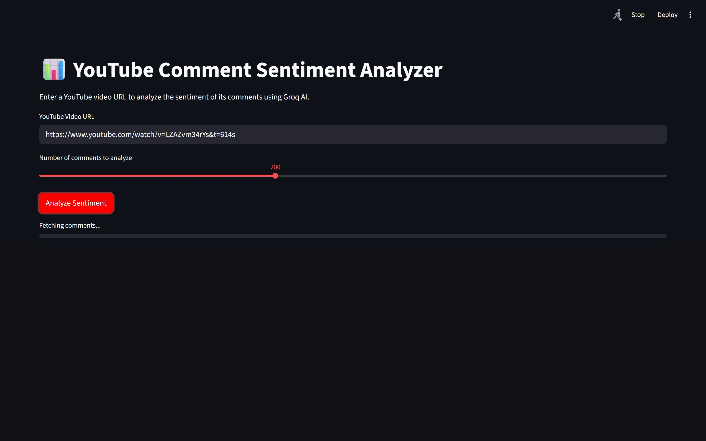
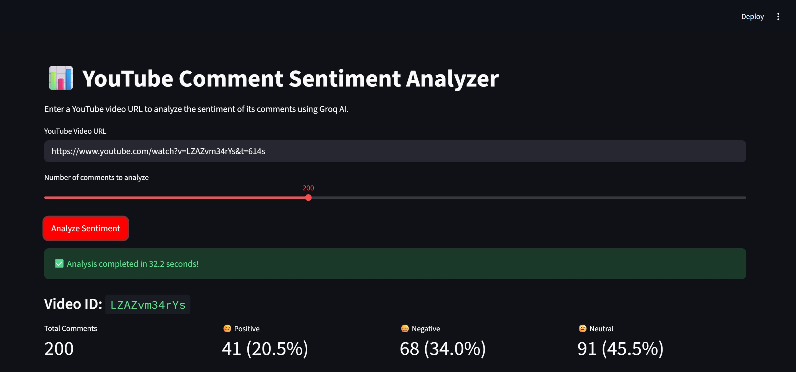
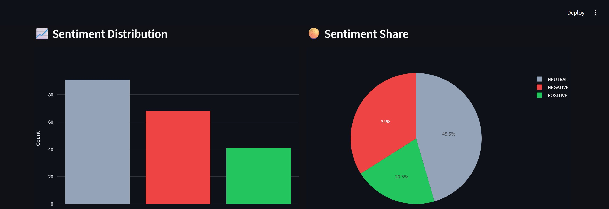
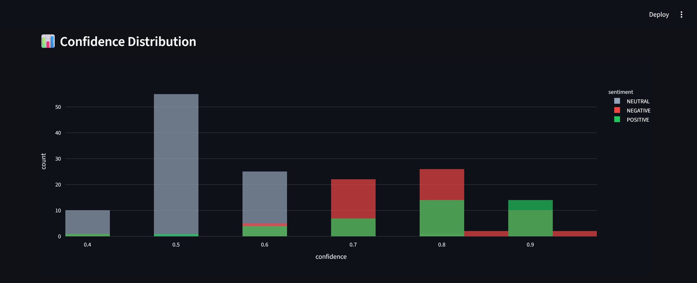
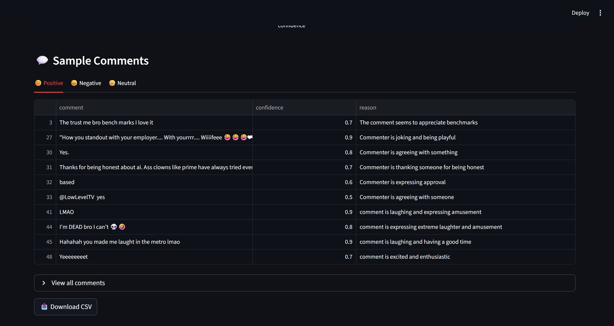

# 📊 YouTube Comment Sentiment Analyzer

A Streamlit web app that fetches YouTube comments and analyzes their sentiment using **Groq AI (LLaMA 3.3 70B)** — completely free, no billing required.


---

## ✨ Features

- 🔍 Fetch up to 500 YouTube comments without a YouTube API key
- 🤖 Sentiment analysis powered by LLaMA 3.3 70B via Groq (handles sarcasm, slang, emojis)
- 📈 Interactive charts — bar, pie, and confidence distribution
- 💬 Sample comments tab broken down by sentiment
- 📥 Download full results as CSV
- ⚡ Completely free — no billing needed

---

## 🖥️ Demo

**Paste a URL, pick a comment count, hit Analyze:**



**Instant metrics — total, positive, negative, neutral breakdown:**



**Interactive sentiment distribution and share charts:**



**Confidence distribution across sentiments:**



**Sample comments per sentiment with AI-generated reasons:**



---

## 🚀 Getting Started

### 1. Clone the repository

```bash
<<<<<<< HEAD
git clone https://github.com/krishrakholiya32/Youtube-Sentiment-Analyzer.git
cd Youtube-Sentiment-Analyzer
=======
git clone https://github.com/krishrakholiya32/Youtube-Sentiment-Analyzer.git
cd Youtube-Sentiment-Analyzer
>>>>>>> 51fa08d62729557527c831769410f5dedb817c6d
```

### 2. Install dependencies

```bash
pip install -r requirements.txt
```

### 3. Set up your API key

Get your free Groq API key at [console.groq.com](https://console.groq.com) — no billing required.

```bash
cp .env.example .env
```

Open `.env` and paste your key:

```
GROQ_API_KEY=gsk_your_groq_api_key_here
```

### 4. Run the app

```bash
streamlit run app.py
```

Open [http://localhost:8501](http://localhost:8501) in your browser.

---

## 📁 Project Structure

```
youtube-sentiment-analyzer/
├── app.py                        # Main Streamlit app
├── requirements.txt              # Python dependencies
├── .env.example                  # Environment variable template
├── .env                          # Your actual API key (never committed)
├── .gitignore                    # Ignores .env and other files
├── README.md                     # This file
└── screenshots/                  # Demo screenshots
    ├── screenshot_1_main.png
    ├── screenshot_2_results.png
    ├── screenshot_3_charts.png
    ├── screenshot_4_confidence.png
    └── screenshot_5_comments.png
```

---

## 🛠️ Tech Stack

| Tool | Purpose |
|------|---------|
| [Streamlit](https://streamlit.io) | Web app framework |
| [Groq](https://groq.com) | Free LLM API (LLaMA 3.3 70B) |
| [youtube-comment-downloader](https://github.com/egbertbouman/youtube-comment-downloader) | Fetch YouTube comments without API key |
| [Plotly](https://plotly.com) | Interactive charts |
| [Pandas](https://pandas.pydata.org) | Data processing |

---

## ⚙️ How It Works

1. Comments are fetched sorted by popularity (most liked first) using `youtube-comment-downloader`
2. Comments are batched into groups of 20 and sent to Groq's LLaMA 3.3 70B model
3. The model returns a JSON array with sentiment, confidence score, and reason for each comment
4. Results are visualized with interactive Plotly charts

---

## 📊 Groq Free Tier Limits

| Limit | Value |
|-------|-------|
| Requests per minute | 30 |
| Requests per day | 14,400 |
| Max comments per day | ~288,000 |
| Cost | Free |

---

## 📝 License

MIT — feel free to use, modify, and share.
